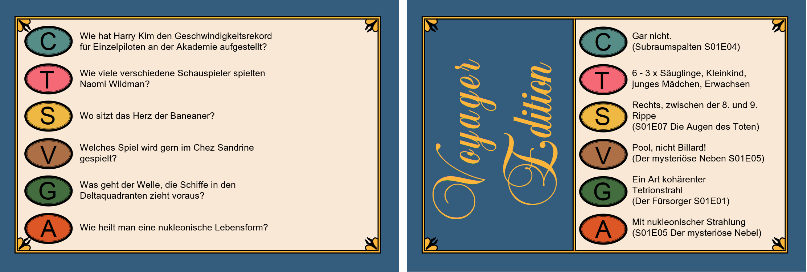

# TrivialPursuitFramework

This framework creates question cards for the game Trivial Pursuit. 
Just create a questions.txt, think about six categories and start the `trivial_pursuit_creator.py` script.

*Example cards for a Star Trek Trivial Pursuit*

### Creating question cards
A question card consists of 6 questions. A questions has an answer and is assigned to a category defined in the categories.txt file. Each answer could contain a citation, which is always written in brackets (). 